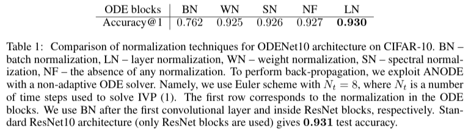
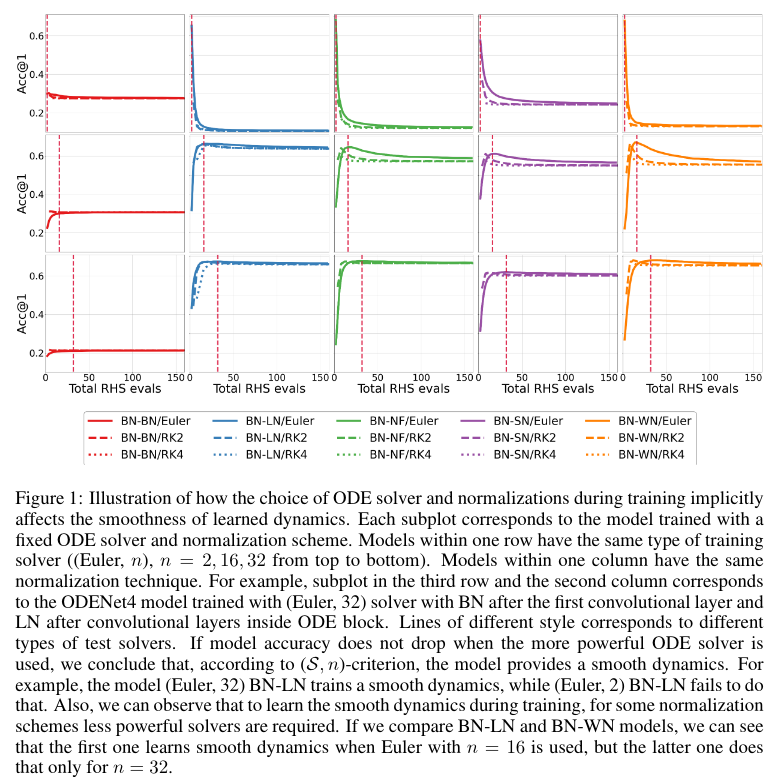

# Towards Understanding Normalization in Neural ODEs
Repository to reproduce experiments from the  [paper](https://arxiv.org/abs/2004.09222)
 presented at [ICLR 2020 DeepDiffeq workshop](http://iclr2020deepdiffeq.rice.edu/) 
 
 
 
## Requirements
```
numpy
pytorch>=1.0
```

## Models
We consider neural ODE based models, which are build from ResNets by replacing ResNet blocks with ODE blocks (only blocks that do not reduce spacial dimentions are replaced).

For example, ODENet4 and ODENet10 architectures have the following form:
- ODENet4:
```conv -> norm -> activation -> ODE block -> avgpool -> fc```
- ODENet10:
```conv -> norm -> activation -> ResNet block -> ODE block -> ResNet block -> ODE block -> avgpool ->fc```

## Normalization
In  our  experiments,  we  assume  that  normalizations  for  all  ResNet  blocks  are  the  same,  as  well as for all ODE blocks.  Along with these two normalizations, we vary a normalization technique after the first convolutional layer.

Our framework support both layer outputs and layer weights normalization techniques:\
**Layer output normalizations**:
- ```BN```(Batch Normalization),
- ```LN``` (Layer Normalization),
- ```NormFree``` (absence of layer output normalization)

**Layer weights normalizations**:
- ```WN```(Weight Normalization),
- ```SpecN``` (Spectral Normalization),
- ```ParamNormFree``` (absence of layer weights normalization) 

## Solver
To propagate through ODE blocks different fixed-step solvers might be used:
- ```Euler``` (Euler scheme)
- ```RK2``` (Runge-Kutta 2)
- ```RK4``` (Runge-Kutta 4)

Solver type as well as the number of solver steps are hyperparameters.


## Train ODENet
Training procedure is performed as in [ANODE paper](https://arxiv.org/pdf/1902.10298.pdf)
1. Create a config file with  model, solver and training hypermarameters\
(see, for example ```./config/odenet4_bn-ln_euler-32.cfg```, which is used to train ODENet4 with BN after the first convolutional layer, LN inside the ODE block and Euler solver with 32 steps) 
2. Inside  ```./run_training.sh```  modify pathes for
- config file
- data folder (CIFAR-10 will be loaded automatically)
- save folder (log file and checkpoints will be saved in this folder)

3. Run training:
```bash run_training.sh ```

## Pre-trained models
Please, follow the [link](https://drive.google.com/drive/folders/1fm8jpXvA9DyOlzLfZ7k18ahZ0SRRDVix?usp=sharing) to download pre-trained models, namely
- ODENet4, BN-LN, trained with Euler solver with n = 2, 8 or 32 steps
- ODENet4, BN-WN, trained with Euler solver with n = 2, 8 or 32 steps

## Selected results
- ODENet10 



- ODENet4 



## Reference
If you found this code useful, we appreciate  if you  cite the following paper
```
@article{gusak2020towards,
  title={Towards Understanding Normalization in Neural ODEs},
  author={Gusak, Julia and Markeeva, Larisa and Daulbaev, Talgat and Katrutsa, Alexandr and Cichocki, Andrzej and Oseledets, Ivan},
  journal={arXiv preprint arXiv:2004.09222},
  year={2020}
}
```
